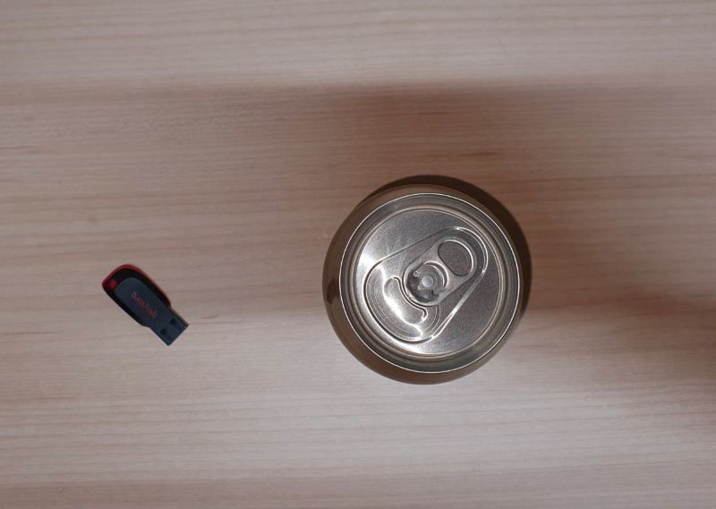
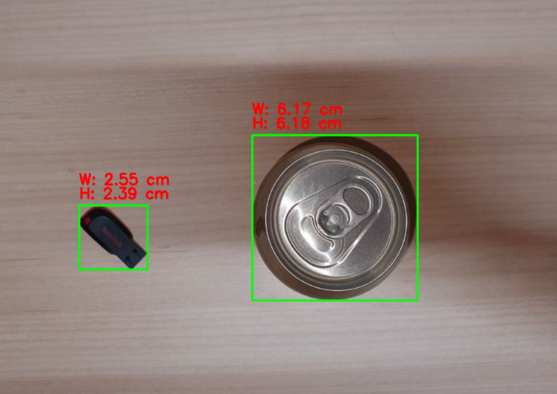

# Object Size Measurement Using OpenCV
This project provides a simple and accurate way to measure object sizes in images using computer vision techniques. By using a reference object of known dimensions, the program can calculate the size of other objects in the image.

## Features
- Automatic object detection and measurement
- Real-time size calculation in centimeters
- Support for multiple objects in a single image
- Visual output with measurements displayed on the image
- Uses a reference object for accurate scaling

## Example
##### Sample image



##### Sample image result



## Requirements
The project uses the following Python packages:
- `opencv-python` (Version: 4.x)
- `numpy` (Version: 1.x)

## Prerequisites
Before running this project, make sure you have Python installed on your system. Then install the required packages:
```bash
pip install opencv-python numpy
```

## How to Run
1. Clone the repository or download the script.
2. Prepare an image (`.jpg`, `.png`, etc.) containing objects to measure along with a reference object of known width.
3. Specify the path to the image and the width of the reference object in centimeters:
    
    ```python
    image_path = "이미지.jpg"
    reference_width = 3.5
    ```
    
4. Run the script:
    
    ```bash
    python measure_object.py
    ```
    
5. The output image will display the measured dimensions of each object.

## How It Works
1. The script detects contours in the image using edge detection and contour approximation.
2. The reference object is identified based on its position (assumed to be the leftmost object).
3. The pixel-to-centimeter ratio is calculated using the known width of the reference object.
4. The dimensions of other objects are measured in pixels and converted to real-world units using the calculated ratio.

## Limitations
- Requires a clear, well-lit image with a visible reference object
- Accuracy depends on image quality and reference object placement
- Works best with objects on a uniform background

## License
This project is open-source and available under the MIT License.