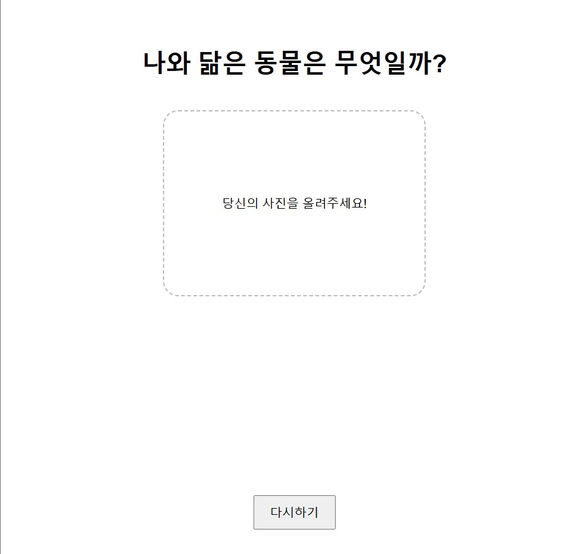
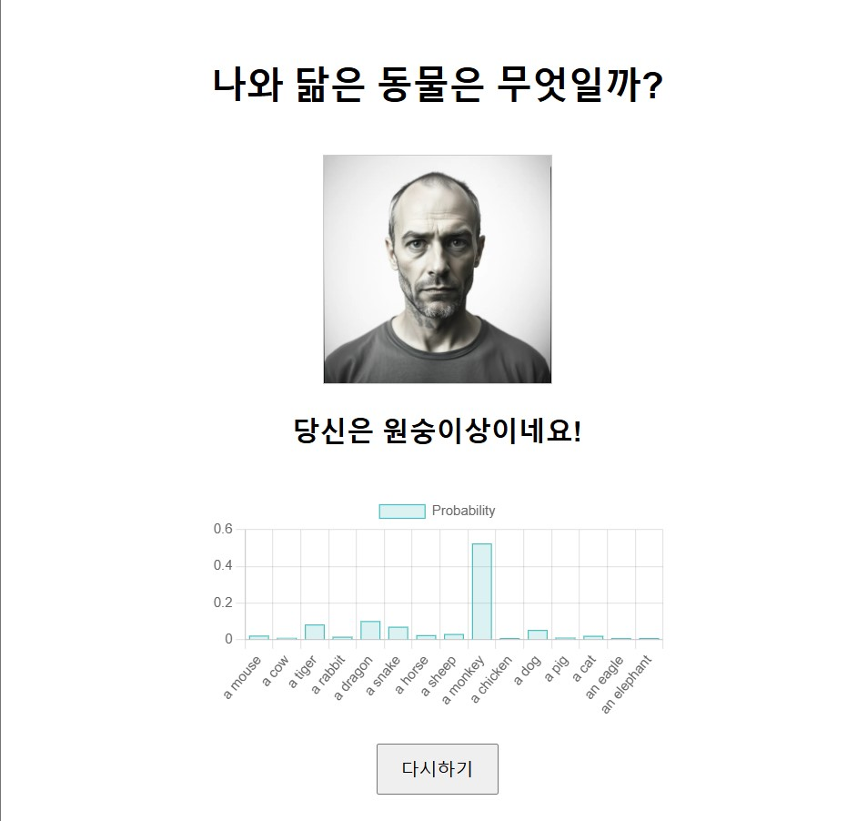

# Gachon University Open Source SW Team Project - Group 58
## Animal Similarity Checker
### 202135764_RYUGERNWOO

## Summary
- * Zero-shot-image classification
A program that uses the zero-shot-image classification using Huggingface's CLIP model to receive a person's photo in drag and drop from the website and to display in graph which animal the photo is most similar to. 

- * Combining Python and JavaScript
To allow requests between JavaScript and Python servers, I connected the Flask Web server to the JavaScript client by enabling CORS in Flask, and imported Chart.js to the CDN to draw graphs. 

## **Requirements: (with versions I tested on)**
1. python           (3.12.7)
2. Flask            (3.1.0)
3. flask-cors       (5.0.0)
4. transformers     (4.46.3)
5. torch            (2.5.1+cu121)
6. Pillow           (10.2.0)
```sh
$ pip install Flask flask-cors transformers torch Pillow
```

## **How to use:**
1. Run python backend
Start the Flask server by running the app.py file
```sh
$ python app.py
```
2. Open HTML File
Run the index.html file in a web browser

3. Image drag-and-drop
Drag and drop an image from a web page, and the image is sent to the Flask server, and the probability for each animal is calculated and displayed as a graph.

## **Result**



## **The limitations**
1. Since it cannot be targeted at all animals, it consists of only 15 types of random animals
2. Most human photographs are likely to be similar to monkeys...
3. Since this program is intended for Koreans, the results are printed in Korean.